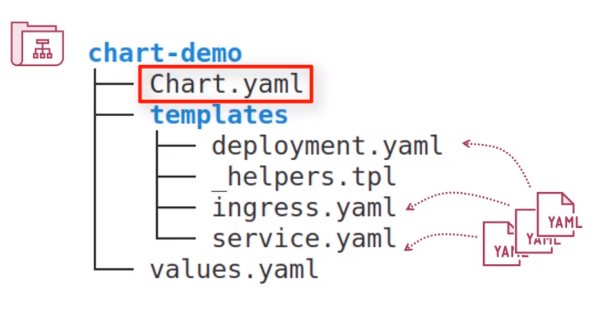
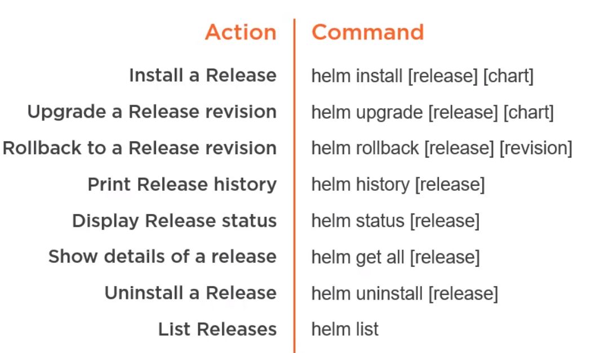

## What is Helm?

Helm is a package manager for Kubernetes. The package is our Kubernetes config files, like Pods, Services, ConfigMaps, etc. Helm can run "install" and "upgrade" on those packages. 

You can define a **Chart**, which is a package of your application and pass it to Helm so that it can deal with the deployment. Helm stores the release configuration inside the Kubernetes cluster as Secrets. 

By default, Helm installs your packages in the default namespace, but you can install them in different ones. We call an instance of the chart running in the cluster as **Release**.

Chart Structure:

Main Commands:
